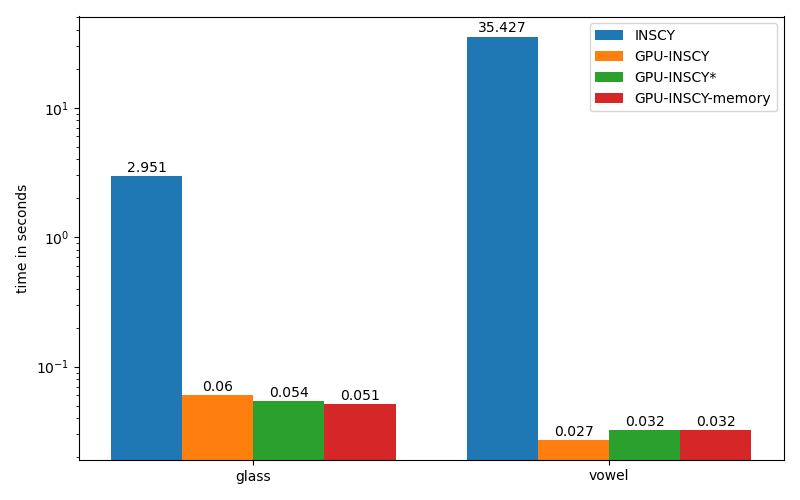

# GPU-INSCY
Implementation of GPU-INSCY from the article "GPU-INSCY: A GPU-Parallel Algorithm and Tree Structure for Efficient Density-based Subspace Clustering".

## Requirements
The implementation has only been tested on a workstation with Ubuntu 18 LTS and CUDA 10.1. Therefore, the implementation might not run on MAC or Windows.

The important packages used are: torch=1.6.0, numpy=1.19.2, matplotlib=3.3.2, pandas=1.1.3, and ninja=1.10.0. However, it should work for newer versions.

Install the newest versions:
```
pip install -r requirements.txt
```

## Example
The implementation comes with three real-world datasets vowel, glass, and pendigits.

Run a small example with INSCY, GPU-INSCY, GPU-INSCY*, and GPU-INSCY-memory, on the datasets vowel and glass:
```
python run_example.py
```
Running the script should take around 5 minutes and end out a plot of the average running times.
The pendigits dataset is not a part of the example since it would take around 8 hours for INSCY to process.

